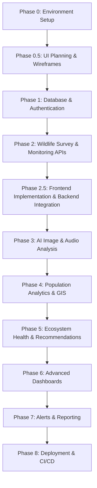

# Wildlife Population Intelligence System: End-to-End Production Implementation Guide

## Project Scope

This document is the single source of truth for implementing the Wildlife Population Intelligence System.

Implementation must proceed phase-by-phase. A phase is considered complete only when all Exit Criteria have been satisfied. Do not begin subsequent phases until the current phase is fully implemented, tested, and verified.

Features scheduled for later phases must not be implemented early unless explicitly required by a dependency.

This document provides a highly structured, precise, phase-by-phase blueprint for building, testing, and deploying the **Wildlife Population Intelligence System** from scratch to a production-ready level. 

---

## Part 1: AI Credit Optimization & Cost-Efficiency Best Practices
To minimize AI token usage, optimize context sizes, and prevent credit drain when pairing with LLM coding agents, adhere to the following rules:

1. **Targeted Code Modifications:**
   - **Do not** ask the AI to rewrite entire files. Provide the specific function or class that needs modification.
   - Use diff-based tools (`replace_file_content` or `multi_replace_file_content`) to apply surgical edits rather than replacing large files.
2. **Context Minimization:**
   - Keep files clean and modular. Large single-file monoliths bloat the prompt context.
   - When asking for help, only share the relevant schemas or signatures of dependency files instead of their full implementations.
3. **Local Mocking of Heavy APIs & ML Inference:**
   - Mock expensive external services (e.g., NASA EarthData, Sentinel Hub, Google Earth Engine) and heavy AI models (YOLOv8, BirdNET, YAMNet) with light, deterministic Python fixtures during development and unit testing.
   - Run AI model inference on CPU or with small dummy arrays (e.g., `np.zeros`) during integration tests.
4. **Fail-Fast Shell & Test Verification:**
   - Run tests target-by-target (e.g., `pytest tests/test_auth.py`) rather than running the full test suite repeatedly.
   - Avoid infinite loops by setting timeouts on background tasks and terminal commands.
5. **Clear Exit Criteria:**
   - Before launching the agent on a task, define a concrete definition of done (e.g., "Implement the CRUD endpoints for surveys and verify with a test script"). Avoid open-ended instructions like "make this page look better" or "improve the system performance."
   - Be concise. No long explanations unless the user asks.
   - After running a command, report only: what ran, result (ok/error), next step.
   - Do not re-explain completed steps.
   - Do not show full file contents unless the user asks.
   - Use bullet points, not paragraphs.
   - One phase at a time. Don't generate future phases until the current one is done.
6. Never regenerate an unchanged file.
7. Modify only affected files.
8. Search existing modules before creating new ones.
9. Reuse existing utilities and components whenever possible.
10. Batch related edits into a single operation.
11. Summarize test output unless debugging is required.
12. Keep implementation responses concise unless detailed explanations are requested.

---

## Part 2: Phase 0 – Local Environment Initialization & Dependency Setup
This phase prepares your machine and initializes the development environment inside the current directory (`E:\INFOSYS INTERNSHIP`).

### 1. Repository & Directory Architecture
We will set up a monorepo structure containing a backend directory (`/backend`) and a frontend directory (`/frontend`).

```text
E:\INFOSYS INTERNSHIP\
├── backend\
│   ├── app\
│   │   ├── api\          # REST endpoints (auth, surveys, analytics)
│   │   ├── core\         # Config, security, DB connections
│   │   ├── models\       # SQLAlchemy & MongoDB schemas
│   │   ├── services\     # ML/AI inference, GIS calculations, alerts
│   │   └── main.py       # FastAPI entry point
│   ├── requirements.txt  # Python dependencies
│   └── .env              # Backend environment configuration
├── frontend\
│   ├── src\
│   │   ├── components\   # Reusable UI components (maps, charts, cards)
│   │   ├── pages\        # Dashboard screens (Researcher, Officer, Admin)
│   │   ├── services\     # API clients (axios instances)
│   │   └── App.js        # React root
│   ├── package.json      # Node dependencies
│   └── .env              # Frontend environment configuration
├── docker-compose.yml    # Multi-container local orchestration
└── README.md
```

### 2. Backend Environment & Dependency Installation
Run the following steps to initialize a Python virtual environment right inside the project root and install all backend libraries.

```bash
# Navigate to the workspace root
# Create a local virtual environment named "venv"
python -m venv venv

# Activate the virtual environment
# On Windows PowerShell:
.\venv\Scripts\Activate.ps1
# On Windows Command Prompt:
.\venv\Scripts\activate.bat

# Upgrade pip
python -m pip install --upgrade pip
```

Create `backend/requirements.txt` with the following contents:
```text
# FastAPI & Server
fastapi==0.110.0
uvicorn[standard]==0.28.0
pydantic[email]==2.6.4
pydantic-settings==2.2.1

# Database Drivers & ORM
SQLAlchemy==2.0.28
psycopg2-binary==2.9.9
pymongo==4.6.2
redis==5.0.3

# Authentication
python-jose[cryptography]==3.3.0
passlib[bcrypt]==1.7.4
python-multipart==0.0.9

# Scientific Computing & Analytics
numpy==1.26.4
pandas==2.2.1
scikit-learn==1.4.1.post1
xgboost==2.0.3

# GIS & Remote Sensing
shapely==2.0.3
geojson==3.1.0
geopandas==0.14.3
rasterio==1.3.9
gdal==3.8.4

# Exports & Utilities
reportlab==4.1.0
openpyxl==3.1.2
httpx==0.27.0
python-dotenv==1.0.1
celery==5.3.6
```
*(Note: If GDAL installation fails on Windows, download the precompiled binary wheel matching your Python version from official binary builders, or use conda/Docker).*

Install the requirements:
```bash
pip install -r backend/requirements.txt
```

### 3. Frontend Environment & Dependency Installation
Create the frontend application using React and Tailwind CSS in the `frontend/` directory.

```bash
# Initialize a Vite-React project in a folder named frontend
npx -y create-vite frontend --template react

# Navigate into the frontend folder
cd frontend

# Install core dependencies
npm install axios react-router-dom lucide-react @tailwindcss/vite leaflet react-leaflet chart.js react-chartjs-2 @mapbox/mapbox-gl
```

### 4. Database & Infrastructure Readiness (Local Docker Compose)
To avoid manual installation of PostgreSQL, PostGIS, MongoDB, Redis, and RabbitMQ on your local Windows system, create a `docker-compose.yml` file in the root directory:

```yaml
version: '3.8'

services:
  postgres:
    image: postgis/postgis:15-3.3
    container_name: wildlife_postgres
    environment:
      POSTGRES_DB: wildlife_db
      POSTGRES_USER: admin
      POSTGRES_PASSWORD: supersecretpassword
    ports:
      - "5432:5432"
    volumes:
      - pgdata:/var/lib/postgresql/data

  mongodb:
    image: mongo:6.0
    container_name: wildlife_mongodb
    environment:
      MONGO_INITDB_ROOT_USERNAME: admin
      MONGO_INITDB_ROOT_PASSWORD: supersecretpassword
    ports:
      - "27017:27017"
    volumes:
      - mongodata:/data/db

  redis:
    image: redis:7.0-alpine
    container_name: wildlife_redis
    ports:
      - "6379:6379"

  rabbitmq:
    image: rabbitmq:3.11-management-alpine
    container_name: wildlife_rabbitmq
    ports:
      - "5672:5672"
      - "15672:15672"

volumes:
  pgdata:
  mongodata:
```
Run `docker-compose up -d` to start all supporting databases.

### Exit Criteria

- Virtual environment created
- Backend dependencies installed
- Frontend dependencies installed
- Docker services running
- Database connections verified
---

## Part 3: Phase-by-Phase Implementation Plan



---

### Phase 0.5

#### UI Planning

Create wireframes for

- Login
- Register
- Dashboard
- Survey Management
- Monitoring Site
- Test Media Upload
- User Profile

Finalize navigation before coding.

---

### Phase 1: Core Database Schemas, Security & Authentication (Week 1)
**Goal:** Establish secure role-based access control (RBAC) and system initialization.

#### 1. SQL database (PostgreSQL + PostGIS) Schema Design
Store structured relations including Users, Surveys, Monitoring Sites, Detections, and Incident Reports.
```sql
CREATE EXTENSION IF NOT EXISTS postgis;

CREATE TYPE user_role AS ENUM ('Researcher', 'Officer', 'ForestDept', 'Admin');

CREATE TABLE users (
    id SERIAL PRIMARY KEY,
    email VARCHAR(255) UNIQUE NOT NULL,
    hashed_password VARCHAR(255) NOT NULL,
    full_name VARCHAR(255) NOT NULL,
    role user_role NOT NULL DEFAULT 'Researcher',
    is_active BOOLEAN DEFAULT TRUE,
    created_at TIMESTAMP DEFAULT CURRENT_TIMESTAMP
);

CREATE TABLE monitoring_sites (
    id SERIAL PRIMARY KEY,
    name VARCHAR(255) NOT NULL,
    location GEOMETRY(Point, 4326), -- PostGIS Spatial Data Point
    habitat_type VARCHAR(100) NOT NULL, -- Forest, Grassland, Wetlands, etc.
    protected_area VARCHAR(255),
    created_at TIMESTAMP DEFAULT CURRENT_TIMESTAMP
);
```

#### 2. NoSQL Database (MongoDB) Schema Design
Store semi-structured and high-frequency sensor readings, raw environmental data, and raw metadata.
- **Collection: `sensor_logs`**
  ```json
  {
    "_id": "ObjectId",
    "site_id": 101,
    "device_type": "camera_trap | audio_sensor | environmental",
    "device_status": "active | low_battery | error",
    "battery_level": 82.5,
    "storage_remaining_gb": 45.2,
    "last_ping": "2026-06-30T13:00:00Z"
  }
  ```
- **Collection: `weather_readings`**
  ```json
  {
    "_id": "ObjectId",
    "site_id": 101,
    "timestamp": "2026-06-30T13:00:00Z",
    "temperature_c": 24.5,
    "humidity_pct": 78,
    "lux": 1500,
    "rainfall_mm": 0.0
  }
  ```

#### 3. Backend Secure Authentication Endpoints (`backend/app/core/security.py`)
Implement password hashing using `bcrypt`, JWT token generation, and role checks.
```python
from datetime import datetime, timedelta
from typing import Optional
from jose import jwt
from passlib.context import CryptContext

pwd_context = CryptContext(schemes=["bcrypt"], deprecated="auto")
SECRET_KEY = "YOUR-ULTRA-SECURE-SECRET-KEY"
ALGORITHM = "HS256"

def verify_password(plain_password: str, hashed_password: str) -> bool:
    return pwd_context.verify(plain_password, hashed_password)

def get_password_hash(password: str) -> str:
    return pwd_context.hash(password)

def create_access_token(data: dict, expires_delta: Optional[timedelta] = None):
    to_encode = data.copy()
    expire = datetime.utcnow() + (expires_delta or timedelta(minutes=60))
    to_encode.update({"exp": expire})
    return jwt.encode(to_encode, SECRET_KEY, algorithm=ALGORITHM)
```
#### 4. User Profile Management

Implement authenticated profile management.

Required Endpoints

- GET /api/profile
- PUT /api/profile

Users should be able to

- View profile
- Update full name
- Update password
- Update profile picture (optional)
- View assigned role (read-only)

Validation

- Email cannot be modified directly.
- Password must be hashed.
- Only authenticated users may update their own profile.

#### 5. Role Guard Implementation (`backend/app/api/deps.py`)
```python
from fastapi import Depends, HTTPException, status
from fastapi.security import OAuth2PasswordBearer
from jose import JWTError, jwt
from app.core.security import SECRET_KEY, ALGORITHM
from app.models.sql import User

oauth2_scheme = OAuth2PasswordBearer(tokenUrl="api/auth/token")

def get_current_user(token: str = Depends(oauth2_scheme)) -> User:
    try:
        payload = jwt.decode(token, SECRET_KEY, algorithms=[ALGORITHM])
        email: str = payload.get("sub")
        role: str = payload.get("role")
        if email is None or role is None:
            raise HTTPException(status_code=status.HTTP_401_UNAUTHORIZED)
        return User(email=email, role=role) # Fetch from actual SQL session in production
    except JWTError:
        raise HTTPException(status_code=status.HTTP_401_UNAUTHORIZED)

class RoleChecker:
    def __init__(self, allowed_roles: list[str]):
        self.allowed_roles = allowed_roles

    def __call__(self, current_user: User = Depends(get_current_user)):
        if current_user.role not in self.allowed_roles:
            raise HTTPException(
                status_code=status.HTTP_403_FORBIDDEN, 
                detail="Operation not permitted for this user role."
            )
```
### Exit Criteria

- User registration works
- Login works
- JWT generation verified
- Password hashing verified
- Role protection tested
- Profile management completed
- SQL tables created
- Mongo collections created

---

### Phase 2: Wildlife Survey & Monitoring Management (Week 2)
**Goal:** Build workflows for registering, management, and spatial tracking of surveys, cameras, and audio devices.

#### 1. Database Entities
```sql
CREATE TABLE surveys (
    id SERIAL PRIMARY KEY,
    title VARCHAR(255) NOT NULL,
    start_date DATE NOT NULL,
    end_date DATE,
    description TEXT,
    created_by INTEGER REFERENCES users(id),
    status VARCHAR(50) DEFAULT 'Active' -- Active, Paused, Completed
);

CREATE TABLE devices (
    id SERIAL PRIMARY KEY,
    site_id INTEGER REFERENCES monitoring_sites(id),
    type VARCHAR(50) NOT NULL, -- CameraTrap, AudioSensor
    model_number VARCHAR(100),
    deployment_date DATE NOT NULL,
    status VARCHAR(50) DEFAULT 'Operational'
);
```
#### Monitoring Information Requirements

Every monitoring record should capture

- Survey ID
- Monitoring Location
- GPS Coordinates
- Habitat Type
- Survey Date
- Monitoring Device
- Protected Area

These fields should be available throughout the backend APIs and frontend forms.

#### 2. REST Endpoints (`backend/app/api/endpoints/surveys.py`)
Define API routes to create, read, update, and delete (CRUD) surveys and sites.
```python
from fastapi import APIRouter, Depends
from app.api.deps import get_current_user, RoleChecker
from app.models.schemas import SurveyCreate, SurveyResponse

router = APIRouter()

@router.post("/", response_model=SurveyResponse, dependencies=[Depends(RoleChecker(["Researcher", "Admin"]))])
def create_survey(survey: SurveyCreate, current_user = Depends(get_current_user)):
    # SQL insertion logic
    return {"message": "Survey created successfully"}
```

#### 3. Observation History

Implement observation history for every monitoring activity.

Required Endpoints

- GET /api/observations
- GET /api/observations/{id}
- GET /api/surveys/{id}/history

Each observation should include

- Survey ID
- Monitoring Site
- Timestamp
- Uploaded Images
- Uploaded Audio
- Researcher
- Device Used
- Observation Notes
---

#### API Documentation

Every endpoint must include

- Request schema
- Response schema
- Validation rules
- Example payloads
- HTTP status codes

Swagger/OpenAPI documentation must remain enabled throughout development.

### Exit Criteria

- Monitoring Site CRUD works
- Survey CRUD works
- Device registration works
- Observation history available
- Upload workflow functional
- APIs documented

---

### Phase 2.5: Frontend Implementation & Backend Integration (Week 2)

**Goal:** Build the complete frontend foundation by implementing the approved UI designs and seamlessly integrating them with the completed Phase 1 and Phase 2 backend APIs.

> **Primary Specification**
>
> - `UI_PLANNING.md` is the **primary implementation specification** for this phase.
> - `IMPLEMENTATION_GUIDE.md` defines the backend architecture, API contracts, security model, and project structure.
> - If both documents overlap, follow:
>   1. UI_PLANNING.md for UI/UX, layouts, navigation, responsiveness, and component hierarchy.
>   2. IMPLEMENTATION_GUIDE.md for backend behavior, APIs, validation, RBAC, authentication, and data flow.

---

#### Implementation Requirements

Implement the frontend exactly according to `UI_PLANNING.md`.

This phase includes:

- Authentication pages
  - Login
  - Register
  - User Profile

- Application Layout
  - Sidebar
  - Top Navigation
  - Protected Routes
  - Role-aware Navigation

- Core Pages
  - Dashboard Shell (without analytics)
  - Survey Management
  - Monitoring Sites
  - Device Management

- Test Media Upload
  - Image Upload
  - Audio Upload
  - File Preview
  - Upload Progress
  - Upload Validation
  - Successful Storage Confirmation

Implement only upload functionality.

Do **NOT** perform:

- AI inference
- Species detection
- Population estimation
- Audio classification
- Charts
- GIS
- Analytics
- Reports
- Alerts

Those belong to later phases.

---

#### Backend Integration Requirements

The frontend must integrate directly with the completed backend from Phases 1 and 2.

The implementation must ensure:

- No duplicate business logic.
- No duplicated validation.
- No duplicated authentication logic.
- No duplicated RBAC implementation.
- No hardcoded API responses.
- No mock data unless explicitly required for development.

The frontend must consume the existing backend APIs exactly as implemented.

If an integration issue is discovered:

- Fix the backend only if it is a genuine architectural defect.
- Otherwise adapt the frontend to the existing API contract.

Avoid rewriting working backend code.

---

#### API Compatibility Rules

Before connecting any page:

- Verify request payloads.
- Verify response models.
- Verify authentication headers.
- Verify JWT flow.
- Verify RBAC restrictions.
- Verify HTTP status codes.
- Verify validation errors.
- Verify pagination (if applicable).

The frontend must never assume undocumented API behavior.

---

#### Runtime Stability Requirements

The completed application must provide:

- Zero frontend runtime crashes.
- Zero backend runtime crashes caused by frontend integration.
- Proper loading states.
- Proper empty states.
- Proper validation messages.
- Graceful API error handling.
- Graceful network failure handling.
- Graceful authentication expiration handling.

All pages must remain functional even if backend requests fail.

---

#### Code Quality Requirements

- Reuse existing React components.
- Reuse existing Axios services.
- Reuse authentication context.
- Follow the Design System defined in `UI_PLANNING.md`.
- Follow the Responsive Layout Rules defined in `UI_PLANNING.md`.
- Avoid duplicate components.
- Keep components modular.
- Separate UI from API logic.
- Separate API logic from business logic.
- Keep files maintainable and production-ready.

---

#### Exit Criteria

Phase 2.5 is complete only when:

- Every page in `UI_PLANNING.md` is implemented.
- Every page integrates successfully with the backend.
- Authentication works end-to-end.
- Protected routes work correctly.
- RBAC behaves correctly.
- Survey APIs are fully connected.
- Monitoring Site APIs are fully connected.
- Device APIs are fully connected.
- Test image upload works.
- Test audio upload works.
- Responsive layouts work.
- No runtime integration errors remain.
- The application is ready for Phase 3 AI integration without requiring architectural changes.

---

### Phase 3: AI-Powered Media Analysis Engines (Weeks 3-4)
**Goal:** Deploy computer vision and bioacoustic analysis modules to process field inputs.

#### 0. Machine Learning & Computer Vision Dependencies Installation
ultralytics==8.1.29
opencv-python-headless==4.9.0.80
torch==2.2.1 --extra-index-url https://download.pytorch.org/whl/cpu # CPU-only for dev; use cu121 for GPU
torchaudio==2.2.1 --extra-index-url https://download.pytorch.org/whl/cpu
tensorflow-cpu==2.15.0
librosa==0.10.1
soundfile==0.12.1

#### 1. Wildlife Image Analysis Engine (`backend/app/services/image_engine.py`)

Model Integration Strategy

The initial implementation shall use pretrained AI models.

Phase 3 Initial Models

- MegaDetector v5a for wildlife object detection.
- YOLOv8x for species classification.

The architecture must allow these pretrained models to be replaced with fine-tuned models in future phases without requiring frontend or API changes.

Integrate YOLOv8 for detecting and classifying animal instances in uploaded camera trap images.
Inference Architecture

The Wildlife Image Analysis Engine must act as an abstraction layer over the underlying AI models.

The frontend and API must never directly depend on a specific AI model.

Initially integrate:

- MegaDetector v5a
- YOLOv8x

Future models should be replaceable without changing frontend code or API contracts.

Image Validation

Before AI inference begins, validate:

- Supported image format
- File integrity
- Image readability
- Minimum image resolution

Invalid images must return appropriate validation errors without invoking the AI model.

```python
import cv2
from ultralytics import YOLO

class WildlifeImageEngine:
    def __init__(self, model_path: str = "models/yolov8n_wildlife.pt"):
        # Load pre-trained or custom-trained YOLOv8 weights
        self.model = YOLO(model_path)

    def analyze_image(self, image_path: str):
        results = self.model(image_path)
        detections = []
        for result in results:
            boxes = result.boxes
            for box in boxes:
                x1, y1, x2, y2 = box.xyxy[0].tolist()
                confidence = float(box.conf[0])
                class_id = int(box.cls[0])
                label = self.model.names[class_id]
                
                detections.append({
                    "label": label,
                    "confidence": confidence,
                    "bounding_box": [x1, y1, x2, y2]
                })
        return detections
```
Prediction Response Format

Every successful inference must return a structured response.

Required fields

- detected_species
- confidence
- bounding_boxes
- inference_time_ms
- model_name
- model_version
- prediction_timestamp


#### 2. Bioacoustic Recognition Engine (`backend/app/services/audio_engine.py`)
Process bird sounds and mammal vocalizations using Librosa, loading TensorFlow-based BirdNET/YAMNet model classifiers.
```python
import librosa
import numpy as np
import tensorflow as tf

class BioacousticEngine:
    def __init__(self, model_path: str = "models/yamnet.tflite"):
        # Initialize TFLite interpreter for YAMNet / BirdNET
        self.interpreter = tf.lite.Interpreter(model_path=model_path)
        self.interpreter.allocate_tensors()
        self.input_details = self.interpreter.get_input_details()
        self.output_details = self.interpreter.get_output_details()

    def preprocess_audio(self, audio_path: str, target_sr: int = 16000) -> np.ndarray:
        # Load audio using librosa
        y, sr = librosa.load(audio_path, sr=target_sr, mono=True)
        # Pad or slice to match expected input duration (e.g., 5 seconds = 80000 samples)
        if len(y) < 80000:
            y = np.pad(y, (0, 80000 - len(y)), 'constant')
        else:
            y = y[:80000]
        return y.astype(np.float32)

    def predict_call(self, audio_path: str):
        input_data = self.preprocess_audio(audio_path)
        # Reshape to expected input shape, e.g., (1, 80000)
        input_data = np.expand_dims(input_data, axis=0)
        
        self.interpreter.set_tensor(self.input_details[0]['index'], input_data)
        self.interpreter.invoke()
        output_data = self.interpreter.get_tensor(self.output_details[0]['index'])
        
        # Softmax or class parsing logic to extract dominant animal call ID
        predicted_class_id = np.argmax(output_data[0])
        confidence = float(output_data[0][predicted_class_id])
        return {"class_id": predicted_class_id, "confidence": confidence}
```

#### 3. AI Inference API

Implement dedicated AI inference endpoints to decouple the frontend from the underlying AI models.

Required Endpoints

- POST /api/ai/image/analyze
- POST /api/ai/audio/analyze
- GET /api/ai/results/{id}

Requirements

- Accept uploaded media identifiers instead of raw files whenever possible.
- Retrieve uploaded media from MongoDB Atlas GridFS.
- Pass the reconstructed media to the appropriate AI engine.
- Return structured prediction results.
- Protect all endpoints using the existing JWT authentication and RBAC system.

Inference Workflow

User Upload
        ↓
MongoDB Atlas GridFS
        ↓
Retrieve Original Media
        ↓
Wildlife Image Analysis Engine
        ↓
Species Prediction
        ↓
Store Prediction Results
        ↓
Return Prediction Response


#### 4. Species Identification & Queue Processing
- Because AI execution takes time, configure **Celery** with **Redis** as a broker.
- When an image/audio is uploaded, save it to storage, push a task to the queue, and return a transaction token.
- Once analyzed, update SQL tables with detections:
Prediction Metadata

Every completed inference must persist prediction metadata.

Minimum metadata

- Model Name
- Model Version
- Prediction Timestamp
- Processing Time
- Confidence Score
- Media ID
- GridFS File ID
- Prediction Status

This metadata will support future analytics, auditing, reporting, and model comparison.

```sql
CREATE TABLE detections (
    id SERIAL PRIMARY KEY,
    site_id INTEGER REFERENCES monitoring_sites(id),
    survey_id INTEGER REFERENCES surveys(id),
    media_type VARCHAR(20), -- Image, Audio
    file_url TEXT NOT NULL,
    detected_species VARCHAR(150),
    confidence DOUBLE PRECISION,
    bounding_box JSONB, -- Coordinates for visualization
    timestamp TIMESTAMP DEFAULT CURRENT_TIMESTAMP
);
```
#### Exit Criteria

- Image inference operational
- Audio inference operational
- GridFS retrieval operational
- AI inference APIs operational
- Species detection stored
- Prediction metadata stored
- Structured prediction responses verified
- Celery queue functioning

---

### Phase 4: Population Analytics & GIS Spatial Mapping (Weeks 5-6)
**Goal:** Estimate population metrics and display geo-referenced distribution trends.

#### 1. Population & Density Calculations (`backend/app/services/population_analytics.py`)
Implement spatial capture-recapture calculations and simple density estimation:
$$\text{Density } (D) = \frac{N \times \text{Average Confidence}}{A}$$
Where:
- $N$ = Number of distinct animals detected (de-duplicated based on detection timestamp grouping).
- $A$ = Effective monitoring area of the camera traps ($km^2$).

```python
import pandas as pd

class PopulationAnalytics:
    @staticmethod
    def estimate_density(detections_df: pd.DataFrame, area_sq_km: float) -> float:
        if detections_df.empty:
            return 0.0
        # Group detections by 10-minute intervals to avoid counting the same individual multiple times
        detections_df['time_block'] = pd.to_datetime(detections_df['timestamp']).dt.round('10min')
        unique_events = detections_df.groupby(['time_block', 'detected_species']).size().reset_index()
        total_detections = len(unique_events)
        return float(total_detections / area_sq_km)
```

#### 2. Biodiversity Index Calculator (Shannon-Wiener Index)
Calculate ecosystem biodiversity health:
$$H' = -\sum_{i=1}^{S} p_i \ln(p_i)$$
Where $p_i$ is the proportion of total individuals belonging to species $i$.

```python
import math
from typing import Dict

def calculate_shannon_index(species_counts: Dict[str, int]) -> float:
    total_individuals = sum(species_counts.values())
    if total_individuals == 0:
        return 0.0
    
    shannon_index = 0.0
    for count in species_counts.values():
        p_i = count / total_individuals
        if p_i > 0:
            shannon_index -= p_i * math.log(p_i)
            
    return round(shannon_index, 3)
```

#### 3. GIS Habitat Suitability Analysis (Rasterio & GeoPandas)
Process satellite imagery (NDVI calculation) using Sentinel Hub/Rasterio.
```python
import rasterio
import numpy as np

def calculate_ndvi(red_band_path: str, nir_band_path: str, output_path: str):
    with rasterio.open(red_band_path) as red:
        red_band = red.read(1).astype('float32')
    with rasterio.open(nir_band_path) as nir:
        nir_band = nir.read(1).astype('float32')
        
    # Calculate NDVI (Normalized Difference Vegetation Index)
    # Avoid division by zero
    denominator = nir_band + red_band
    denominator[denominator == 0] = 1e-5
    ndvi = (nir_band - red_band) / denominator
    
    # Save the output raster
    meta = red.meta
    meta.update(dtype=rasterio.float32, count=1)
    with rasterio.open(output_path, 'w', **meta) as dst:
        dst.write(ndvi, 1)
```

### Exit Criteria

- Population estimation working
- Biodiversity calculations validated
- GIS processing functional
---

### Phase 5: Wildlife Health Scoring & Recommendation Engine (Week 6)
**Goal:** Apply the weighted ecosystem equation and dynamically serve habitat recommendations.

#### 1. Weighted Ecosystem Health Scoring Algorithm
The ecosystem health score is determined as:
$$\text{Ecosystem Health Score} = 0.30(S_d) + 0.25(P_s) + 0.20(H_q) + 0.15(E_s) + 0.10(E_c)$$
Where:
- $S_d$ = Species Diversity Score (Normalized Shannon Index, scaled 0 to 100)
- $P_s$ = Population Stability Score (Rate of change of population size over time)
- $H_q$ = Habitat Quality Score (Average NDVI vegetation score)
- $E_s$ = Endangered Species Status (Inversely proportional to number of active threats)
- $E_c$ = Environmental Conditions (Based on air quality, temperature range stability)

```python
def calculate_ecosystem_health(
    species_diversity: float,  # Scale: 0 - 100
    population_stability: float,  # Scale: 0 - 100
    habitat_quality: float,  # Scale: 0 - 100
    endangered_status: float,  # Scale: 0 - 100
    environmental_conditions: float  # Scale: 0 - 100
) -> dict:
    score = (
        0.30 * species_diversity +
        0.25 * population_stability +
        0.20 * habitat_quality +
        0.15 * endangered_status +
        0.10 * environmental_conditions
    )
    
    # Classify Conservation Status
    if score >= 85:
        status = "Excellent"
    elif score >= 70:
        status = "Healthy"
    elif score >= 50:
        status = "Moderate Concern"
    elif score >= 30:
        status = "Vulnerable"
    else:
        status = "Critical"
        
    return {"health_score": round(score, 2), "status": status}
```

#### 2. Recommendation Generator Rules
Implement logical pathways to suggest intervention guidelines:
```python
def generate_recommendations(score_details: dict) -> list[str]:
    recommendations = []
    if score_details["status"] in ["Critical", "Vulnerable"]:
        recommendations.append("Initiate immediate habitat restoration and establish a strictly controlled buffer zone.")
    if score_details["habitat_quality"] < 50:
        recommendations.append("Perform field investigation for soil erosion, local logging, or pollution.")
    if score_details["endangered_status"] < 40:
        recommendations.append("Deploy additional camera traps and request localized forest ranger patrols.")
    return recommendations
```
### Exit Criteria

- Ecosystem score generated
- Recommendation engine functional
- Conservation status calculated

---

### Phase 6: Advanced Frontend Dashboards & GIS Map (Weeks 7-8)
**Goal:** Deliver role-based visualization components.

#### 1. Leaflet GIS Viewer Component (`frontend/src/components/GISMap.jsx`)
Render spatial points with popups representing species detections.
```jsx
import React from 'react';
import { MapContainer, TileLayer, Marker, Popup } from 'react-leaflet';
import 'leaflet/dist/leaflet.css';

export default function GISMap({ sites }) {
  return (
    <MapContainer center={[20.5937, 78.9629]} zoom={5} className="h-125 w-full rounded-lg shadow-lg">
      <TileLayer
        url="https://{s}.tile.openstreetmap.org/{z}/{x}/{y}.png"
        attribution='&copy; <a href="https://osm.org/copyright">OpenStreetMap</a> contributors'
      />
      {sites.map((site) => (
        <Marker key={site.id} position={[site.lat, site.lng]}>
          <Popup>
            <div className="font-sans">
              <h3 className="font-bold text-lg">{site.name}</h3>
              <p><strong>Habitat:</strong> {site.habitat_type}</p>
              <p><strong>Health Status:</strong> {site.health_status}</p>
            </div>
          </Popup>
        </Marker>
      ))}
    </MapContainer>
  );
}
```

#### 2. Analytics Chart Dashboard
Utilize `react-chartjs-2` to display species population distributions:
```jsx
import React from 'react';
import { Bar } from 'react-chartjs-2';
import { Chart as ChartJS, CategoryScale, LinearScale, BarElement, Title, Tooltip, Legend } from 'chart.js';

ChartJS.register(CategoryScale, LinearScale, BarElement, Title, Tooltip, Legend);

export default function SpeciesDistributionChart({ data }) {
  const chartData = {
    labels: Object.keys(data),
    datasets: [{
      label: 'Detection Frequency',
      data: Object.values(data),
      backgroundColor: 'rgba(34, 197, 94, 0.6)',
      borderColor: 'rgb(34, 197, 94)',
      borderWidth: 1,
    }]
  };

  return <Bar data={chartData} options={{ responsive: true, plugins: { legend: { position: 'top' } } }} />;
}
```
### Exit Criteria

- Dashboards operational
- Maps rendering
- Charts displaying live data
- Role-specific dashboards complete

---

### Phase 7: Alerts, Exports & Reporting (Week 8)
**Goal:** Implement automated alerting systems and reporting modules.

#### 1. Endangered Species Alert System (Celery Task)
```python
from celery import Celery
from app.services.notifications import send_email_alert, send_sms_alert

app = Celery("wildlife_tasks", broker="redis://localhost:6379/0")

@app.task
def check_for_alerts(detection_data: dict):
    # If the species is listed as endangered, fire real-time warnings
    if detection_data.get("is_endangered") and detection_data.get("confidence") > 0.85:
        message = f"ALERT: Critically endangered species ({detection_data['species']}) detected at Site {detection_data['site_id']}!"
        send_email_alert("ranger-group@park.org", subject="Endangered Species Alert", body=message)
        send_sms_alert("+123456789", message)
```

#### 2. PDF Report Generator (`backend/app/services/pdf_generator.py`)
```python
from reportlab.lib.pagesizes import letter
from reportlab.pdfgen import canvas

def generate_pdf_report(filename: str, report_data: dict):
    c = canvas.Canvas(filename, pagesize=letter)
    c.drawString(100, 750, "Wildlife Population Intelligence System Report")
    c.drawString(100, 730, f"Ecosystem Health Score: {report_data['health_score']}")
    c.drawString(100, 710, f"Conservation Status: {report_data['status']}")
    c.drawString(100, 690, "Recommendations:")
    
    y = 670
    for rec in report_data['recommendations']:
        c.drawString(120, y, f"- {rec}")
        y -= 20
        
    c.save()
```
### Exit Criteria

- Alerts dispatched
- Reports generated
- PDF export works
- Excel export works

---

### Phase 8: Containerization & Cloud Deployment Setup (Week 8+)
**Goal:** Scale the applications, configure networks, and write pipelines for staging and production.

#### 1. Backend Production Dockerfile (`backend/Dockerfile`)
```dockerfile
# Multi-stage build for Python with C dependencies (like GDAL/GeoPandas)
FROM python:3.11-slim as builder

WORKDIR /app
RUN apt-get update && apt-get install -y --no-install-recommends \
    build-essential \
    libgdal-dev \
    g++ \
    && rm -rf /var/lib/apt/lists/*

COPY requirements.txt .
RUN pip install --no-cache-dir --user -r requirements.txt

FROM python:3.11-slim as runner
WORKDIR /app
RUN apt-get update && apt-get install -y --no-install-recommends \
    libgdal-dev \
    && rm -rf /var/lib/apt/lists/*

COPY --from=builder /root/.local /root/.local
COPY . .

ENV PATH=/root/.local/bin:$PATH
EXPOSE 8000
CMD ["uvicorn", "app.main:app", "--host", "0.0.0.0", "--port", "8000"]
```

#### 2. Frontend Production Dockerfile (`frontend/Dockerfile`)
```dockerfile
# Build React static files
FROM node:20-alpine as builder
WORKDIR /app
COPY package*.json ./
RUN npm ci
COPY . .
RUN npm run build

# Serve via highly performant Nginx webserver
FROM nginx:alpine
COPY --from=builder /app/dist /usr/share/nginx/html
COPY nginx.conf /etc/nginx/conf.d/default.conf
EXPOSE 80
CMD ["nginx", "-g", "daemon off;"]
```

#### 3. Continuous Integration Pipeline (`.github/workflows/deploy.yml`)
```yaml
name: Deploy Wildlife Platform to AWS/Azure

on:
  push:
    branches: [ main ]

jobs:
  build-and-deploy:
    runs-on: ubuntu-latest
    steps:
      - name: Checkout Code
        uses: actions/checkout@v3

      - name: Configure AWS Credentials
        uses: aws-actions/configure-aws-credentials@v1
        with:
          aws-access-key-id: ${{ secrets.AWS_ACCESS_KEY_ID }}
          aws-secret-access-key: ${{ secrets.AWS_SECRET_ACCESS_KEY }}
          aws-region: us-east-1

      - name: Build and Push Docker Images to ECR
        run: |
          aws ecr get-login-password --region us-east-1 | docker login --username AWS --password-stdin <YOUR_ACCOUNT_ID>.dkr.ecr.us-east-1.amazonaws.com
          docker build -t wildlife-backend ./backend
          docker tag wildlife-backend:latest <YOUR_ACCOUNT_ID>.dkr.ecr.us-east-1.amazonaws.com/wildlife-backend:latest
          docker push <YOUR_ACCOUNT_ID>.dkr.ecr.us-east-1.amazonaws.com/wildlife-backend:latest

      - name: Deploy Task Definition to ECS Fargate
        run: |
          aws ecs update-service --cluster wildlife-cluster --service wildlife-service --force-new-deployment
```
### Exit Criteria

- Docker deployment verified
- CI/CD pipeline working
- Backend reachable
- Frontend reachable
- End-to-end workflow validated

---

## Part 4: Phase-by-Phase Verification & System Health Check

| Phase       | Milestone Task                   | Verification Command / Target                                                             |
| :---------- | :------------------------------- | :---------------------------------------------------------------------------------------- |
| **Phase 0** | Venv & Package Validation        | `python -c "import fastapi, torch, ultralytics; print('Backend Dependencies OK')"`        |
| **Phase 1** | Auth API Integration             | `pytest tests/test_auth.py`                                                               |
| **Phase 2** | Survey Database CRUD             | Query database: `SELECT * FROM surveys;`                                                  |
| **Phase 3** | CV/Audio Inference Check         | Run offline validation script: `python scripts/test_inference.py`                         |
| **Phase 4** | Population & Biodiversity math   | Validate Shannon Index values against expected analytical test matrices                   |
| **Phase 5** | Weighted Health Scoring          | Validate output status matching for values (e.g. status: "Critical" for score < 30)       |
| **Phase 6** | UI GIS Viewport                  | Launch dev server (`npm run dev`) and test spatial coordinates binding on the Leaflet map |
| **Phase 7** | Alert dispatch pipeline          | Fire test warning payload: `celery -A app.worker.celery_app worker --loglevel=info`       |
| **Phase 8** | Multi-container Local Deployment | Start production build simulation: `docker-compose -f docker-compose.prod.yml up --build` |
