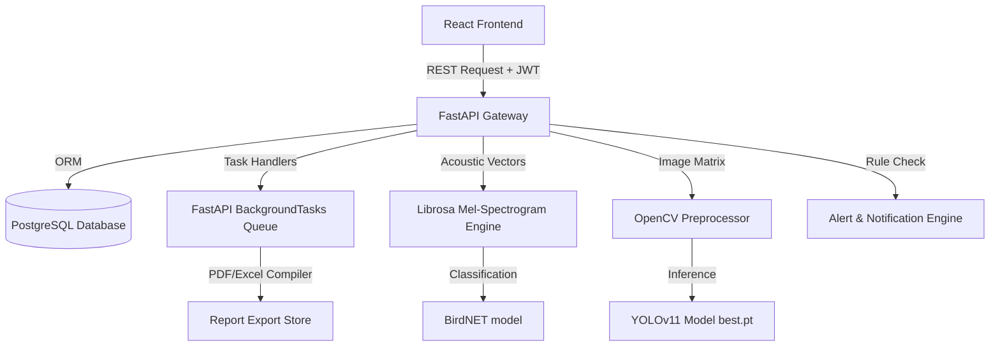

# Wildlife Population Intelligence System (WPIS)

[](LICENSE)
[]()
[]()
[]()
[]()

WPIS is a production-grade, AI-powered enterprise ecological monitoring platform. It is engineered for national park authorities, forest department beat teams, conservation agencies, and wildlife researchers. The platform enables automated wildlife species classification, bioacoustic vocalization analysis, population density calculations, habitat suitability mapping, anti-poaching patrol beat scheduling, and automated security incident tracking.

---

## 🎯 Objectives
- **Automate Ecological Auditing**: Eliminate manual review bottlenecks for camera traps and audio sensors.
- **Provide Actionable Intelligence**: Link spatial overlays with automated anti-poaching patrol routes.
- **Maintain Scientific Accuracy**: Compute standardized Shannon-Wiener and Simpson diversity indices using validated formulas.
- **Ensure Enterprise Security**: Establish granular Role-Based Access Control (RBAC) to isolate sensitive field data.

---

## 🏗️ Architecture Design & Flow



### Core Data Flow
1. **Raw Telemetry Upload**: Wildlife images or audio recordings are uploaded via the frontend.
2. **AI Inference & Noise-Filtering**:
   - Audio files are split into 3-second segments, filtered, converted to Mel-spectrograms by Librosa, and analyzed by the BirdNET classifier.
   - Images are processed by OpenCV (640x640 resize) and evaluated by YOLOv11 (`backend/models/best.pt`).
3. **Database Logging**: Detections exceeding the confidence threshold are committed to the `observations` PostgreSQL table. Low-confidence sightings are logged for manual human verification.
4. **Ecosystem Metrics Calculation**: Analytical services retrieve sightings to calculate Species Richness, Shannon Diversity Index ($H'$), Simpson Dominance Index ($D$), and Habitat Suitability Index (HSI).
5. **Dashboard Rendering & Reporting**: The frontend displays interactive charts and Leaflet maps, and users can request asynchronous document downloads compiled in the background.

---

## 🛠️ Technology Stack
- **Backend API Gateway**: Python, FastAPI, Uvicorn, SQLAlchemy ORM.
- **Frontend Dashboard**: JavaScript, React.js, Tailwind CSS, Leaflet.js, OpenStreetMap, Recharts.
- **Primary Database**: PostgreSQL (PostGIS-ready database schema).
- **Machine Learning & AI**: 
  - Computer Vision: Ultralytics YOLOv11, OpenCV.
  - Audio Intelligence: BirdNET, Librosa, NumPy.
- **Containerization & Hosting**: Docker, Docker Compose, Nginx.

---

## 📂 Project Directory Structure

```
Wildlife_Population_AI/
├── backend/
│   ├── app/
│   │   ├── auth/             # JWT encryption & RBAC security checkers
│   │   ├── database/         # PostgreSQL connection configs & schemas
│   │   ├── models/           # SQLAlchemy database model mappings
│   │   ├── routers/          # REST API endpoints (auth, sites, AI, health)
│   │   ├── schemas/          # Pydantic data validation schemas
│   │   └── services/         # Core computations (AI inference, metrics, reports)
│   ├── models/               # Model weights (best.pt)
│   ├── Dockerfile
│   └── requirements.txt
├── frontend/
│   ├── src/
│   │   ├── components/       # Reusable layout cards & filter bars
│   │   ├── context/          # React Auth and Theme context providers
│   │   ├── hooks/            # Custom React hooks (useAuth, useTheme)
│   │   ├── pages/            # Page layouts (Dashboard, Population, AI Uploads)
│   │   ├── services/         # Axios API connection configurations
│   │   └── utils/            # Mappings & Indian species localization
│   ├── nginx.conf
│   ├── Dockerfile
│   └── package.json
├── docker-compose.yml
└── README.md
```

---

## 🔐 Database Schema & Relationships

- **users / roles**: User registries mapped in a Many-to-Many association table (`user_roles`).
- **monitoring_sites**: Primary GPS locations indicating reserve boundaries and protected area flags.
- **surveys**: Linked to monitoring sites (Many-to-One), containing start/end dates and telemetry device configurations.
- **camera_traps / audio_sensors**: Hardware registries linked to monitoring sites (Many-to-One).
- **observations**: Logged wildlife sightings containing coordinates, timestamps, identified species, and confidence scores.
- **notifications**: Alerts categorized by severity (`Critical`, `Warning`) and target reserve zones.
- **report_history**: Logged generated exports linking request parameters and file download links.

---

## 🚀 Installation & Local Execution

### Local Development Setup

#### 1. Setup the Database
Install PostgreSQL on your local machine and create the target database:
```sql
CREATE DATABASE wildlife_db;
```

#### 2. Backend Setup
1. Navigate to the backend directory and set up a virtual environment:
   ```bash
   cd backend
   python -m venv venv
   source venv/bin/activate  # On Windows: venv\Scripts\activate
   ```
2. Install Python dependencies:
   ```bash
   pip install -r requirements.txt
   ```
3. Run the FastAPI development server:
   ```bash
   uvicorn app.main:app --reload --port 8000
   ```
   *Note: Database tables and default roles/users are auto-seeded on first run.*

#### 3. Frontend Setup
1. Navigate to the frontend directory:
   ```bash
   cd ../frontend
   ```
2. Install npm packages:
   ```bash
   npm install
   ```
3. Run Vite in development mode:
   ```bash
   npm run dev
   ```

---

## 🐋 Containerized Orchestration (Production Ready)

To deploy the entire stack (PostgreSQL, FastAPI Backend, and React Frontend proxy) in a single command:

### 1. Build and Launch Containers
```bash
docker compose up --build -d
```

### 2. Verify Container Health
- **React Client Dashboard**: `http://localhost:80`
- **FastAPI Backend Gateway**: `http://localhost:8000`
- **System Health Status Endpoint**: `http://localhost:8000/api/health`

---

## ⚙️ Environment Variables (`.env.example`)

Copy the template below to `.env` inside the `/backend` folder:
```ini
DB_HOST=postgres
DB_PORT=5432
DB_NAME=wildlife_db
DB_USER=your_username
DB_PASSWORD=your_db_password

SECRET_KEY=<your-secret-key>
ALGORITHM=HS256
ACCESS_TOKEN_EXPIRE_MINUTES=60

GOOGLE_CLIENT_ID=your_google_client_id.apps.googleusercontent.com
GEMINI_API_KEY=your_gemini_api_key_here
GEMINI_MODEL=gemini-1.5-flash
```

---


## 🪪 License & Contributors
- **License**: MIT Enterprise License
- **Contributors**: Aarti / Advanced Agentic Coding
