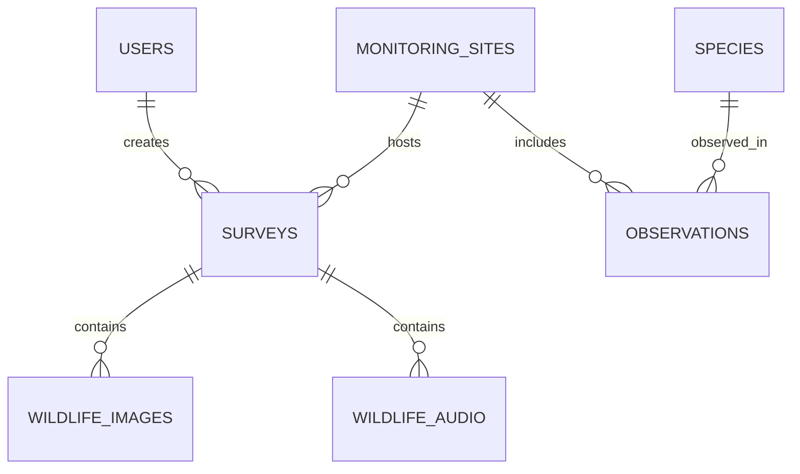

# ER Diagram

```mermaid
erDiagram
    USERS ||--o{ SURVEYS : creates
    MONITORING_SITES ||--o{ SURVEYS : hosts
    SURVEYS ||--o{ WILDLIFE_IMAGES : contains
    SURVEYS ||--o{ WILDLIFE_AUDIO : contains
    SPECIES ||--o{ OBSERVATIONS : observed_in
    MONITORING_SITES ||--o{ OBSERVATIONS : includes
```
