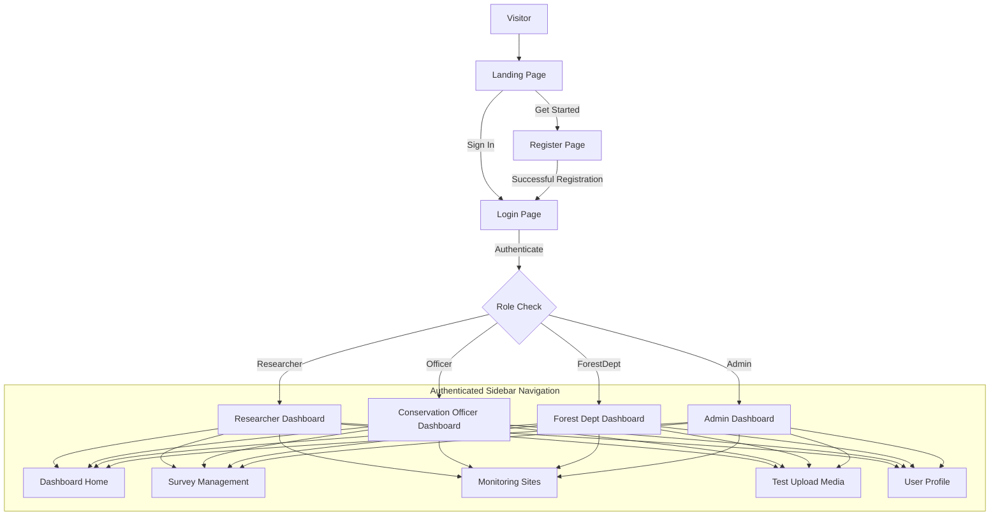

# Wildlife Population Intelligence System – UI Planning & Wireframes

## Scope of this Document
>
> This document defines only the UI planning, navigation, layouts, and wireframes required for Phase 0.5.
>
> Some pages intentionally include placeholder widgets (such as maps, analytics charts, AI results, alerts, and ecosystem metrics) to reserve screen space for future implementation.
>
> These widgets must **NOT** be implemented during Phase 0.5. Their implementation belongs to later phases of the IMPLEMENTATION_GUIDE.md.

This document details the user interface layouts, navigation tree, and component hierarchies for the application. All designs are optimized for **React.js + Tailwind CSS** with a modern, clean, dark-mode-first aesthetic (utilizing emerald, zinc, and mint color palettes).

---

## 1. Global Navigation & Layout Architecture

### Navigation Flow Chart


### Layout Templates

#### Unauthenticated Template (Centered Card Layout)
*   **Viewport:** Fullscreen grid with gradient backdrop (`bg-gradient-to-br from-zinc-950 via-zinc-900 to-emerald-950`).
*   **Card:** Semi-transparent glassmorphic card (`bg-zinc-900/80 backdrop-blur-md border border-zinc-800/80 shadow-2xl rounded-2xl`).

#### Authenticated Template (Sidebar + Content Canvas)
*   **Layout:** Screen-height flex/grid container (`h-screen overflow-hidden bg-zinc-950 text-zinc-100 flex`).
*   **Sidebar (Left):** Width `w-64` (collapsible to `w-20` on mobile). Fixed height, containing system branding, navigation links with state-active indicator rings, user mini-profile badge, and log-out controls.
*   **Main Stage (Right):** Flex-1, vertical flex layout containing:
    *   *Top Navigation Bar:* Site breadcrumbs, real-time alert notifications bell, and role badge.
    *   *Content Frame:* Scrollable area (`overflow-y-auto p-8`) wrapping the specific page workspace.

### Responsive Layout Rules

Desktop (>=1280px)

- Expanded sidebar
- Multi-column layouts

Tablet (768px–1279px)

- Collapsible sidebar
- Reduced spacing
- Responsive grids

Mobile (<768px)

- Drawer navigation
- Single-column layout
- Stacked cards
- Full-width forms

All pages must remain fully usable on mobile devices.

---

## 1.5 Design System

The entire application should follow one consistent design language.

### Color Palette

- Primary: Emerald
- Secondary: Zinc
- Success: Green
- Warning: Amber
- Danger: Red
- Information: Blue

### Typography

- Heading 1
- Heading 2
- Heading 3
- Body
- Caption

### Standard Components

- Buttons
- Input Fields
- Dropdowns
- Cards
- Tables
- Modal Dialogs
- Status Badges
- Chips
- Progress Bars
- Toast Notifications
- Loading Skeletons

Reuse these components throughout the application. Do not create duplicate styles for similar UI elements.

## 2. Wireframe Specifications

### 2.0 Landing Page

**Purpose**

The Landing Page serves as the public entry point of the application. It introduces the Wildlife Population Intelligence System, highlights its objectives, showcases its major capabilities, and guides users toward authentication.

**Layout**

- Sticky Navigation Bar
- Full-screen Hero Section
- About the Platform
- Key Features
- Intended Users
- System Workflow
- Footer

**Navigation Bar**

- Project Logo
- Home
- About
- Features
- Sign In
- Get Started

**Hero Section**

Large headline:

> AI Wildlife Population Intelligence System

Subtitle:

> AI-powered wildlife monitoring and biodiversity intelligence platform for researchers, conservation organizations, and forest departments.

Primary Button

- Get Started

Secondary Button

- Sign In

Hero Illustration

- Forest
- Wildlife
- AI Dashboard
- Camera Trap
- Drone
- Audio Sensor

**About Section**

Explain:

- Wildlife monitoring
- Biodiversity conservation
- AI-powered analysis
- Population intelligence

**Feature Cards**

- Wildlife Detection
- Bioacoustic Recognition
- Habitat Intelligence
- Population Analytics
- Monitoring Sites
- Secure Research Platform

**Who Uses It**

Cards for:

- Wildlife Researchers
- Conservation Officers
- Forest Departments
- Administrators

**System Workflow**

Image / Audio

↓

AI Processing

↓

Species Identification

↓

Population Intelligence

↓

Dashboard & Reports

The workflow is informational only.
Do NOT imply these AI capabilities are already implemented.

**Footer**

- About
- Contact
- GitHub (optional)
- Version
- Copyright

```
+--------------------------------------------------------------+
| Logo      Home   About   Features      Sign In  Get Started |
+--------------------------------------------------------------+

|         AI Wildlife Population Intelligence System          |

| AI-powered wildlife monitoring for biodiversity conservation|

|      [ Get Started ]      [ Sign In ]                       |

---------------------------------------------------------------

|  Wildlife Detection | Bioacoustics | Population Analytics   |

| Habitat Intelligence | Monitoring Sites | Secure Platform   |

---------------------------------------------------------------

|               System Workflow Graphic                       |

---------------------------------------------------------------

| Footer                                                      |
+--------------------------------------------------------------+
```

### 2.1 Login Page
*   **Backdrop:** Centered glassmorphic card.
*   **UI Components:**
    *   Brand Identity Header (System name and icon).
    *   Email Input: With validation state icons (email format validation).
    *   Password Input: With toggle visibility control (show/hide password).
    *   Access Role Indicator: Informational info-box indicating that roles are pre-assigned or select-based on registration.
    *   Primary Action Button: "Sign In" (`bg-emerald-600 hover:bg-emerald-500 transition`).
    *   Alternative Action Links: 
        *   Back to Home, 
        *   Don't have an account? Register
    *   Back to Home / Landing Page link.
```text
+-------------------------------------------------------------------+
|                                                                   |
|                   [ Wildlife Intell System Logo ]                 |
|                     Wildlife Population System                    |
|                                                                   |
|                  +-----------------------------+                  |
|                  | Email Address               |                  |
|                  | [ researcher@park.org     ] |                  |
|                  +-----------------------------+                  |
|                                                                   |
|                  +-----------------------------+                  |
|                  | Password                [o] |                  |
|                  | [ **********              ] |                  |
|                  +-----------------------------+                  |
|                                                                   |
|                  [  Sign In Button (Emerald)   ]                  |
|                                                                   |
|                  Don't have an account? Register                  |
|                                                                   |
+-------------------------------------------------------------------+
```

---

### 2.2 Register Page
*   **Backdrop:** Centered glassmorphic card (slightly taller than Login).
*   **UI Components:**
    *   Full Name input field.
    *   Email input field.
    *   Password input field (with password strength indicator bar).
    *   Role Selector (Dropdown matching roles: `Researcher`, `Conservation Officer`, `Forest Department Officer`).
    *   Primary Action Button: "Create Account" (`bg-emerald-600 hover:bg-emerald-500`).
    *   Alternative Action Link: "Already have an account? Sign In".

```text
+-------------------------------------------------------------------+
|                                                                   |
|                     Create Your Account                           |
|                                                                   |
|                  +-----------------------------+                  |
|                  | Full Name                   |                  |
|                  | [ Dr. Jane Doe            ] |                  |
|                  +-----------------------------+                  |
|                                                                   |
|                  +-----------------------------+                  |
|                  | Email Address               |                  |
|                  | [ j.doe@park.org          ] |                  |
|                  +-----------------------------+                  |
|                                                                   |
|                  +-----------------------------+                  |
|                  | Password                    |                  |
|                  | [ **********              ] |                  |
|                  +-----------------------------+                  |
|                  | [=== Strength: Strong ====] |                  |
|                                                                   |
|                  +-----------------------------+                  |
|                  | Account Role                |                  |
|                  | [ Wildlife Researcher     V ] |                  |
|                  +-----------------------------+                  |
|                                                                   |
|                  [   Register Button (Emerald) ]                  |
|                                                                   |
|                  Already have an account? Sign In                 |
|                                                                   |
+-------------------------------------------------------------------+
```

---

### 2.3 Main Dashboard
*   **Layout:** Left Sidebar + Main stage grid.
*   **UI Components:**
    *   **KPI Scorecards Row:**
        *   Total Species Detections (Placeholder – Implement in Phase 3)
        *   Ecosystem Health Score (Placeholder – Implement in Phase 5)
        *   Active Surveys
        *   Alerts (Placeholder – Implement in Phase 7)
    *   **Central Content Grid:**
        *   *Left Grid Column (GIS Viewer):* Interactive Leaflet Map (Placeholder – Phase 4) showing current observation markers.
        *   *Right Grid Column (Active Alerts Stream):* Real-time list of species notifications, sorted by timestamp.
    *   **Bottom Grid Row (Analytical Charts):**
        *   Bar graph showing Species Frequency (Top 5 species detected) (Placeholder – Implement in Phase 4).
        *   Line graph showing Population Trends over time (Placeholder – Implement in Phase 4).

```text
+-------------------------------------------------------------------+
| [Brand]  | Breadcrumbs: Home / Dashboard            [🔔 Alert] [JD] |
|----------+--------------------------------------------------------|
| (•) Dash | [Detections: 1,402] [Health: 82%] [Surveys: 12] [Alert: 3] |
|          | +----------------------------------+ +-----------------+ |
| ( ) Surv | |                                  | | Recent Alerts   | |
|          | |          Leaflet GIS Map         | | - Bengal Tiger  | |
| ( ) Site | |          (Observation         | |   Site A (1m ago) | |
|          | |           Plot Markers)          | | - Deforestation | |
| ( ) Upload| |                                  | |   Site C (10m)  | |
|          | +----------------------------------+ +-----------------+ |
| ( ) Prof | +------------------------------------------------------+ |
|          | | Species Population Distribution Charts               | |
| [Log Out]| +------------------------------------------------------+ |
+-------------------------------------------------------------------+
```

---

### 2.4 Survey Management Page
*   **Layout:** Left Sidebar + Workspace.
*   **UI Components:**
    *   **Header Section:** Title, Search Bar, Filter dropdowns (Status: Active/Completed/Paused), and "New Survey" button (`+` icon).
    *   **Survey Cards Grid:** Clean grid displaying survey summaries:
        *   Survey Title, start/end dates.
        *   Status Tag (e.g. `bg-green-500/20 text-green-400` for Active).
        *   Progress indicators (number of monitoring devices attached, total uploads).
        *   Quick Actions buttons: View Details, Edit, Pause.
    *   **New Survey Modal Form:** Form field overlays to input Title, Dates, Description, and select assigned monitoring sites.

```text
+-------------------------------------------------------------------+
| [Brand]  | Surveys                                                |
|----------+--------------------------------------------------------|
| ( ) Dash | [Search Surveys...  ] [Filter: Active V] [ + New Survey ]|
|          |                                                        |
| (•) Surv | +-----------------------+    +-----------------------+ |
|          | | Serengeti Census 2026 |    | Wetlands Bird Survey  | |
| ( ) Site | | [Active]              |    | [Completed]           | |
|          | | Date: Jan 2026 - Pres |    | Date: May 25 - Dec 25 | |
| ( ) Upload| | Devices: 8 Cameras    |    | Devices: 4 Recorders  | |
|          | | [View] [Pause] [Edit] |    | [View] [Resume] [Edit]| |
| ( ) Prof | +-----------------------+    +-----------------------+ |
|          |                                                        |
| [Log Out]| Showing 1-2 of 2 surveys                               |
+-------------------------------------------------------------------+
```

---

### 2.5 Monitoring Site Page
*   **Layout:** Left Sidebar + Workspace.
*   **UI Components:**
    *   **Header Section:** Title, "Add Site" button, search.
    *   **Split Workspace Layout:**
        *   *Left Panel (Site Directory):* List of registered locations with coordinate tags, status indicators, and micro-analytics.
        *   *Right Panel (Site Detail View - updates on click):*
            *   Interactive mini-map centered on the selected site location.
            *   Devices list (Attached cameras/audio recorders, battery levels, storage indicators).
            *   Add Device Dialog form trigger.
            *   Ecosystem Health metrics history.

```text
+-------------------------------------------------------------------+
| [Brand]  | Monitoring Sites                                       |
|----------+--------------------------------------------------------|
| ( ) Dash | [Search Sites...   ]                      [ + Add Site ]|
|          | +----------------------+ +-----------------------------+ |
| ( ) Surv | | Site A (Protected)   | | Details: Site A             | |
|          | | Lat: 3.42, Lng: 37.18| | [ Mini-Map Preview ]        | |
| (•) Site | | Devices: 2 Camera    | |                             | |
|          | +----------------------+ | Devices Connected:          | |
| ( ) Upload| | Site B (Buffer Zone) | | - CAM-01 (Bat: 82%, OK)     | |
|          | | Lat: 3.45, Lng: 37.21| | - AUD-04 (Bat: 15%, Charge!)  | |
| ( ) Prof | +----------------------+ +-----------------------------+ |
|          |                                                        |
| [Log Out]| Showing 2 sites                                        |
+-------------------------------------------------------------------+
```

---

### 2.6 Test Upload Media Page
*   **Layout:** Left Sidebar + Drag-and-Drop Area.
*   **UI Components:**
    *   **Interactive Dropzone Area:** Dotted outline with icon (`bg-zinc-900 hover:bg-zinc-800/80 transition cursor-pointer`). Supporting `.jpg`, `.png`, `.wav`, `.mp3` format drops.
    *   **Target Metadata Selectors:**
        *   Survey Assignment dropdown.
        *   Device / Site Assignment dropdown.
    *   **Upload Progress & Processing Queue list:**
        *   Shows progress bar per file (`0% to 100%`).
        *   Status label: `Uploading...`, `Queued for Analysis`, or `Complete`. (AI analysis functionality will be implemented in Phase 3.)
```text
+-------------------------------------------------------------------+
| [Brand]  | Test Upload Media Assets                                    |
|----------+--------------------------------------------------------|
| ( ) Dash | Assign to Survey: [ Serengeti Census 2026            V ]|
|          | Assign to Site:   [ Site A                           V ]|
| ( ) Surv |                                                        |
|          | +----------------------------------------------------+ |
| ( ) Site | |                                                    | |
|          | |             [⬆️ Upload Cloud Icon]                 | |
| (•) Upload| |         Drag & Drop Images / Audio Files           | |
|          | |                  Or Click to Browse                | |
| ( ) Prof | +----------------------------------------------------+ |
|          | File Queue:                                            | |
| [Log Out]| - IMG_0023.jpg [=================== 100%] Processing AI| |
+-------------------------------------------------------------------+
```

---

### 2.7 User Profile Page
*   **Layout:** Left Sidebar + Form grid.
*   **UI Components:**
    *   **Profile Summary Card:** User avatar, name, and read-only Role tag (e.g. "Admin" or "Researcher") in high-contrast badge.
    *   **Editable Profile Details Form:**
        *   Full Name field.
        *   Email field (Disabled/Read-only, cannot be modified directly).
        *   Save Profile Changes Button (`bg-emerald-600`).
    *   **Password Update Section:**
        *   Current Password input.
        *   New Password input.
        *   Confirm New Password input.
        *   Update Password Action Button.

```text
+-------------------------------------------------------------------+
| [Brand]  | My Profile                                             |
|----------+--------------------------------------------------------|
| ( ) Dash | +------------------------+ +-------------------------+ |
|          | | User Details           | | Change Password       | |
| ( ) Surv | | Avatar Image           | | Current Password      | |
|          | | Name: [ Jane Doe     ] | | [ *             ] | |
| ( ) Site | | Role: [ Researcher (R)]| | New Password          | |
|          | | Email: j.doe@park.org  | | [ *             ] | |
| ( ) Upload| | (Read-only)            | | Confirm New Password  | |
|          | |                        | | [ *             ] | |
| (•) Prof | | [ Save Details ]       | | [ Update Password ]   | |
|          | +------------------------+ +-------------------------+ |
| [Log Out]| Profile settings are securely managed                  |
+-------------------------------------------------------------------+
```

---

## 3. UI Phase Checklist & Exit Criteria Verification
To pass Phase 0.5, we verify:
1. All wireframe details (Login, Register, Dashboard, Survey, Site, Media Upload, Profile) are defined.
2. Layout definitions are structured clearly and ready to convert to Tailwind CSS components.
3. User navigations/roles actions are planned and decoupled from DB/backend logic.

## Standard UI States

Every page should define the following states.

### Loading

- Skeleton loaders
- Spinner for API requests

### Empty

Example:

"No surveys available."

"Add your first monitoring site."

### Error

Display clear validation and retry options.

### Success

Show toast notifications for successful actions.

### Disabled

Buttons and inputs should clearly indicate disabled states.

### Accessibility

- Keyboard navigation
- Visible focus indicators
- WCAG AA color contrast
- ARIA labels where applicable